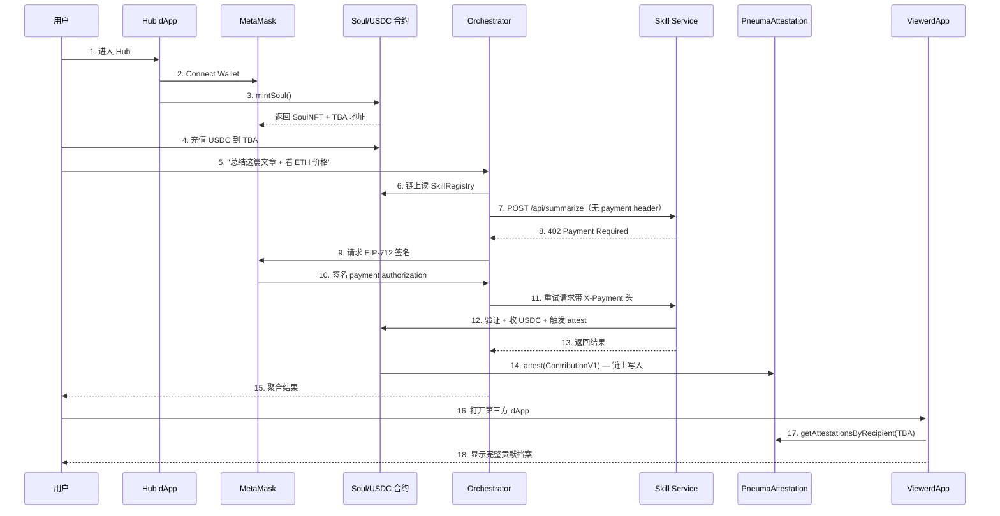

# Pneuma · 黑客松完整方案

> **版本**：v1.1（USDC native）
> **日期**：2026-04-29
> **目标**：4-5 天黑客松级 demo，演示开放协议下 AI Agent 的「可携带身份 + 原生 USDC 支付 + 跨平台贡献档案」三合一闭环
> **独立项目**：合约、文档、命名空间完全独立，不引用任何外部商业项目代码或设计

---

## 一、顶层设计

### 1.1 项目定位

**一句话**：Pneuma 是 AI Agent 的开放协议层 — 把身份、钱包、支付、贡献档案全部放在以太坊标准上，让 Agent 跨平台流动。

**三句话讲清**：

1. AI Agent 现在被锁死在单平台（平台账号 / 单 dApp 身份），平台关了一切归零。
2. Pneuma 用 **ERC-8004 IdentityRegistry**（基于 ERC-721）+ ERC-6551 TBA + **Arc 原生 USDC（同时是 native gas，6 decimals）作为支付层** + 自建 PneumaAttestation（含反洗白 boundary 锚点）+ PneumaTimelock 治理 五件套，把 Agent 的身份、钱包、支付、履历、治理全部链上化。
3. 任何 AI 服务挂上 `@pneuma/x402` 中间件就能收 USDC，任何 dApp 都能读 Agent 的链上履历 — **Agent 的开放身份 + 链上结算 + 可携带履历 三合一**。

### 1.2 黑客松爆点（评委 30 秒能 get）

| 爆点 | 现有方案对比 |
|---|---|
| **Soul 可携带**：平台关了 Soul 还在 MetaMask | 单一平台 Agent 只能在自家域名内用 |
| **Arc 原生 USDC 支付**：可提现 / 可转账 / 可被任何服务接收（真美元 stablecoin） | 走自创积分代币的方案不出平台、无真实美元约束 |
| **贡献档案跨平台读**：dApp B 能直接读 dApp A 的服务记录 | 走中心化 API 的不开放、走链下评分的不可验证 — 我们做"x402 支付凭证锚定的可验证 attestation primitive" |
| **30 秒接入**：任何 AI 服务一行代码挂中间件即可收钱 | x402 协议已有但工具链断层 |

### 1.3 决策清单（已锁定 2026-04-27）

| # | 决策项 | 终值 | 备注 |
|---|---|---|---|
| 1 | 项目名 | **Pneuma** | Soul 中性命名，独立词汇空间；支付层使用 Arc 原生 USDC（无自创代币） |
| 2 | 目标链 | **Arc Testnet 主 + Base Sepolia 副（可选）+ Sepolia fallback** | DEPLOYER 钱包 Arc 已有 11.5 USDC 充足（Arc 上 USDC = native gas）；attestation 自建（见 §三 PneumaAttestation） |
| 3 | Orchestrator | 做 | LLM 任务拆解 + 链上 skill 发现 + x402 自主支付 |
| 4 | AI 服务数量 | 3 个（finance/text/image），D 末兜底砍到 2 | 数量足够撑起多服务编排 demo |
| 5 | LLM | DeepSeek 主 + OpenAI 备 | 双 provider fallback，黑客松成本可控 |
| 6 | 赛道 | 通用 Web3+AI（ETHGlobal 系），不针对单一赛道优化 | 本届黑客松通用，不纠结 |

### 1.4 实现工程量（独立写就，预估颗粒度）

| Pneuma 模块 | 工程量估算 | 说明 |
|---|---|---|
| 身份 NFT（SoulNFT，**真实现 ERC-8004 IdentityRegistry**） | 0.5 天 | ERC-721 + ERC-8004 register/setAgentURI + 自动派生 ERC-6551 TBA + 转主 boundary hook |
| ERC-6551 智能账户（SoulAccount） | 0.5 天 | 基于 ERC-6551 标准 minimal 实现 |
| 支付代币 | 0 天 | 直接对接 Arc 原生 USDC（外部，Circle 部署），无需自部署 |
| SkillRegistry | 0.7 天 | escrow + settle + attest 三段式（IERC20 接口注入 USDC） |
| PneumaAttestation | 0.5 天 | 自建 attestation 注册器 |
| x402 中间件包 | 1.5 天 | EIP-712 签名验证 + Express/Hono adapter |
| Orchestrator | 1 天 | LLM 任务拆解 + 链上 skill 发现 + 并行调用 |
| Frontend hub + viewer | 1.5 天 | Next.js 16 + wagmi + RainbowKit |

> **D1 实测**：合约层 0.5 天完成（含 14 个测试 + Arc Testnet 部署），与估算一致。

### 1.5 协议层定位 vs 单一平台产品

Pneuma 主动定位在**协议层**，区别于市场上常见的"单一平台 Agent 产品"形态：

| 维度 | 单一平台 Agent 产品 | Pneuma |
|---|---|---|
| 层次 | 应用层（具体产品） | **协议层**（任何应用都能接） |
| 边界 | 单一平台，团队运营 | 开放协议，无中心运营方 |
| 身份 | 平台 DB 里的账号 record | 用户 MetaMask 里的 ERC-721 NFT |
| 货币 | 内部积分 / 订阅 / 信用卡 | Arc 原生 USDC，真美元 stablecoin，可转账、可 DEX 交易、可跨链 |
| 互动方式 | 平台私有 API / 事件总线 | 公网 HTTP + x402 + 链上结算 |
| 接入方式 | 走平台 onboarding | 任何人挂 `@pneuma/x402` 中间件即可 |
| 履历 | 私有 schema，仅本平台读 | PneumaAttestation 公开合约，任何 dApp 都能读 |
| 仲裁 | 平台团队人工 | 未来对接链上仲裁（公开仲裁协议 / 自建 jury） |
| 演进规则 | 平台设计的记忆/信用模型 | 各 Agent 主人自己决定 |

**类比**：单一平台产品是 Gmail，Pneuma 是 SMTP/HTTP。**层次不同 → 不抢应用层的饭**。理论上任何应用层产品都能采用 Pneuma 标准来获得开放性。

> **owner 意识**：Pneuma 不下场做应用层产品，专心当协议层 — 故事独立，黑客松定位清晰。

---

## 二、架构总览

### 2.1 系统架构图

```
                          ┌─────────────────────────────────────┐
                          │       Pneuma Core (链上)   │
                          └─────────────────────────────────────┘
                                          │
        ┌──────────────┬───────────────┬──┴──┬───────────────────┐
        ▼              ▼               ▼     ▼                   ▼
   SoulNFT        ERC-6551       USDC (external)  Skill       PneumaAttestation
  (ERC-721 +   (canonical, 已部署)  Arc 原生        Registry      (自建链上 attest 注册器
   ERC-8004 真接入)   TBA Wallet     gas + ERC-20                  + 反洗白 boundary)
        │              │               6 decimals  │                  │
        └──────────────┴───────────────┴───────┴────────────────────┘
                                          │
                          ┌───────────────┴────────────────┐
                          │   x402 USDC Middleware (npm)    │
                          │   @pneuma/x402                   │
                          │   express / hono / next        │
                          └────────────────────────────────┘
                                          │
        ┌──────────────┬─────────────────┴──┬──────────────────┬───────────────┐
        ▼              ▼                    ▼                  ▼               ▼
   Service-A      Service-B            Service-C          Orchestrator      dApp-Viewer
   (finance)      (text)               (image, 兜底砍)     (LLM agent)       (跨平台读)
                                                              │                │
                                                              ▼                ▼
                                                     一句话指令解析       不在主域名下也能
                                                     → 链上发现 skill    → 直接读 Soul 档案
                                                     → x402 自动支付
```

### 2.2 用户旅程



---

## 三、合约层完整设计

> 主链：Arc Testnet（chain id 5042002）/ 副链可选：Base Sepolia / fallback：Sepolia
> 工具链：Foundry（Hardhat 备选）
> Solidity：0.8.26+
> 标准库：OpenZeppelin v5、erc6551
> attestation 自建（不依赖 EAS，因为 Arc 上 EAS 未部署）

### 3.1 合约清单

| # | 合约 | LOC 估算 | 依赖 |
|---|---|---|---|
| C1 | `SoulNFT.sol` | ~120 | OZ ERC-721, AccessControl |
| C2 | `SoulAccount.sol`（ERC-6551 实现） | ~150 | ERC-6551 标准 |
| — | USDC（external） | 0 | Arc 原生（Circle 部署）：`0x3600000000000000000000000000000000000000`（同时是 native gas + ERC-20，6 decimals） |
| C3 | `SkillRegistry.sol` | ~250 | C1, USDC, C4 |
| C4 | `PneumaAttestation.sol`（自建注册器） | ~180 | OZ AccessControl |
| C5 | `BudgetController.sol`（per-TBA daily USDC cap） | ~120 | USDC |
| C6 | `PneumaTimelock.sol` | ~80 | OZ Timelock |

总计 ~900 行 Solidity（不含外部 USDC），单人 D1 全天可写完 + 单元测试。

### 3.2 SoulNFT.sol — Soul身份

```solidity
// SoulNFT 真接入 ERC-8004 IdentityRegistry（minimal subset）。
// + ERC-6551 TBA 自动派生
// + 转主 boundary hook 写 SYSTEM-rater attestation（反洗白链上锚点）
contract SoulNFT is ERC721, AccessControl, IERC8004Identity {
    struct Soul {
        string agentName;          // "Alice's Trading Bot"
        string agentEndpoint;      // 可选的链下入口
        string metadataURI;        // IPFS（ERC-8004 agent card pointer）
        address tba;               // 对应的 ERC-6551 钱包
        uint256 createdAt;
    }

    mapping(uint256 => Soul) public souls;
    address public immutable erc6551Registry;
    address public immutable accountImplementation;

    // Pneuma 自家（带 agentName）便利入口
    function publicMint(string memory agentName, string memory metadataURI)
        external returns (uint256 tokenId, address tba);

    // ERC-8004 IdentityRegistry 标准接口
    function register() external returns (uint256 agentId);
    function register(string calldata agentURI) external returns (uint256 agentId);
    function setAgentURI(uint256 agentId, string calldata newURI) external;

    // 关键：mint 时自动调 6551 Registry 派生 TBA
    // 关键：transfer 时 _update hook 自动写 SYSTEM-rater boundary attestation
}
```

### 3.3 SoulAccount.sol — ERC-6551 智能账户

```solidity
contract SoulAccount is IERC6551Account, IERC1271, IERC165 {
    // 钱包属于 SoulNFT.tokenId 持有者
    function token() external view returns (uint256 chainId, address tokenContract, uint256 tokenId);
    function owner() external view returns (address);  // = SoulNFT.ownerOf(tokenId)
    function execute(address to, uint256 value, bytes calldata data, uint8 operation) external payable;

    // 接收 USDC、ETH、其他 NFT
    receive() external payable;
}
```

> **底层逻辑**：用 canonical ERC-6551 Registry（`0x000000006551c19487814612e58FE06813775758` 多链同地址），不重新部署 Registry。只部署自定义 Account implementation。

### 3.4 USDC — 支付代币（外部，无需自部署）

Pneuma **不发自创支付代币**。支付层直接绑定 Arc 原生 USDC：

| 项 | 值 |
|---|---|
| 合约地址（Arc Testnet） | `0x3600000000000000000000000000000000000000` |
| 双重身份 | 同时是 Arc native gas token **和** 6-decimal ERC-20 接口 |
| 部署方 | Circle（外部，Arc 链官方） |
| 测试 USDC 领取 | [Circle faucet](https://faucet.circle.com) |
| EIP-2612 permit | ✅ Arc 原生 USDC 支持 |

> **设计选择**：协议层用 `IERC20` 接口注入支付代币，部署时绑定到 USDC 合约地址。无自创代币 = 无 friction、stake/slash 立刻有真实美元约束、未来切到 mainnet USDC 即可复用。
> **演示便利**：评委 / 开发者直接用 [Circle faucet](https://faucet.circle.com) 领测试 USDC，不需要任何自有水龙头。

### 3.5 SkillRegistry.sol — 技能注册 + x402 托管

```solidity
contract SkillRegistry {
    struct Skill {
        uint256 skillId;
        uint256 ownerSoulId;       // 谁在卖
        string name;
        string endpoint;            // HTTPS API
        uint256 pricePerCall;       // USDC, 6 decimals (Arc native)
        string[] tags;
        uint256 totalCalls;
        uint256 ratingSum;
        uint256 ratingCount;
        bool active;
    }

    struct CallRecord {
        uint256 callId;
        uint256 skillId;
        uint256 callerSoulId;
        uint256 amountEscrowed;
        uint8 status;               // 0 escrow, 1 settled, 2 disputed
        bytes32 paymentHash;        // x402 EIP-712 hash
        uint256 startedAt;
    }

    mapping(uint256 => Skill) public skills;
    mapping(uint256 => CallRecord) public calls;

    // === 核心方法 ===
    function registerSkill(uint256 ownerSoulId, string memory name, string memory endpoint, uint256 price, string[] memory tags) external returns (uint256 skillId);

    // 调用方先 escrow USDC，服务方完成后 settle
    function escrowForCall(uint256 skillId, uint256 callerSoulId, bytes32 paymentHash) external returns (uint256 callId);
    function settleCall(uint256 callId, uint8 rating) external;     // 由服务方调用
    function refundCall(uint256 callId) external;                    // 超时自动退款

    // 读
    function listSkills(uint256 offset, uint256 limit) external view;
    function getSkill(uint256 skillId) external view returns (Skill memory);

    // 关键：settleCall 内部触发 PneumaAttestation.attest()
}
```

### 3.6 PneumaAttestation.sol — 自建链上 attestation 注册器

> **设计理念**：在 EAS 没部署的链（如 Arc）上，我们自己写一份"x402 支付凭证锚定的 attestation primitive"。schema 公开，存储链上，任何 dApp 直接 call 合约就能读 — 等价于 EAS 的"公开可读"特性，**且与 x402 强耦合**（attestation 内含 paymentHash，可链上反查支付凭证）。

```solidity
contract PneumaAttestation is AccessControl {
    bytes32 public constant ATTESTER_ROLE = keccak256("ATTESTER_ROLE");

    struct Attestation {
        bytes32 uid;
        address recipient;       // = SoulAccount address (TBA)
        address attester;        // = SkillRegistry contract
        uint256 skillId;
        bytes32 paymentHash;     // x402 EIP-712 hash, 锚定支付
        uint8 rating;            // 1-5
        uint256 paidAmount;      // USDC, 6 decimals
        string skillName;        // 跨平台 dApp 可直接显示
        string skillCategory;
        uint256 timestamp;
        bool revoked;
    }

    /// 全局 schema 字符串（公开，链下可校验）
    string public constant SCHEMA = "uint256 skillId, bytes32 paymentHash, uint8 rating, uint256 paidAmount, string skillName, string skillCategory, uint256 timestamp";

    mapping(bytes32 => Attestation) public attestations;
    mapping(address => bytes32[]) private _byRecipient;   // TBA -> uids

    event Attested(bytes32 indexed uid, address indexed recipient, uint256 indexed skillId);
    event Revoked(bytes32 indexed uid);

    /// 仅 SkillRegistry 可调（settle 时自动触发）
    function attest(
        address recipientTBA,
        uint256 skillId,
        bytes32 paymentHash,
        uint8 rating,
        uint256 paidAmount,
        string calldata skillName,
        string calldata skillCategory
    ) external onlyRole(ATTESTER_ROLE) returns (bytes32 uid);

    /// 跨平台读取主入口
    function getAttestationsByRecipient(address tba) external view returns (Attestation[] memory);
    function getAttestation(bytes32 uid) external view returns (Attestation memory);

    /// 允许 attester 撤销（罚没场景）
    function revoke(bytes32 uid) external onlyRole(ATTESTER_ROLE);
}
```

> **跨平台读法**：任何 dApp 知道 PneumaAttestation 合约地址（公开）+ Soul 的 TBA 地址，一行 `getAttestationsByRecipient(tba)` 拿全部履历。零集成成本。

### 3.7 部署顺序（Arc Testnet, 2026-04-29 实测地址）

```
0. USDC（external，Arc 原生）                  → 0x3600000000000000000000000000000000000000
1. SoulAccount impl                           → 0x2325631E1D674098941364997a69C520ab14Be82
2. SoulNFT(impl, registry=0x000...775758)     → 0x4983B6f856885E428A0Cf62F1579A1a031032415
3. PneumaAttestation()                        → 0x169ffe395734374E51BB852391F9F9856B1Fe54E
4. SkillRegistry(soulNFT, USDC, pneumaAttest) → 0xB63c7fBCA41466edF3AB0F78F14a7EB85D8D6B69
5. BudgetController(USDC)                     → 0xcDF3de632Af74097D1f9A2788dE312A207Cc1A95
6. PneumaTimelock                             → 0xec2a731Aa46a53dcE5323018C203828A742996E4
7. PneumaAttestation.grantRole(ATTESTER_ROLE, SkillRegistry)  ← 反向授权 SkillRegistry
```

> **不需要 EAS schema 注册**（自建合约 schema 写在 Solidity constant 里，部署即生效）。

### 3.8 测试用例（Foundry）

| 用例 | 关键断言 |
|---|---|
| `testMintSoul` | mint 后 6551 派生地址正确 |
| `testUSDCPermit` | EIP-2612 permit 流程通（Arc 原生 USDC） |
| `testRegisterSkill` | 注册后 listSkills 能读到 |
| `testEscrowAndSettle` | 调用方扣 USDC、服务方收 USDC、attest 已发 |
| `testRefundOnTimeout` | 超时退款正常 |
| `testCrossPlatformRead` | 不同 caller 都能读 attestation |
| `testGasUsage` | 关键操作 gas 在合理范围 |

> **黑客松实测**：56 个 forge 测试全部 PASS（核心协议 + multi-rater + boundary + ERC-8004 compliance + 撤销/转移）。

---

## 四、x402 USDC Middleware（npm 包）

### 4.1 包结构

```
packages/x402-middleware/
├── package.json              /x402
├── src/
│   ├── index.ts             导出 API
│   ├── core/
│   │   ├── types.ts         PaymentRequirements / PaymentAuthorization
│   │   ├── verify.ts        EIP-712 签名验证
│   │   ├── escrow.ts        与 SkillRegistry 交互
│   │   └── attest.ts        触发 attestation
│   ├── adapters/
│   │   ├── express.ts       Express middleware
│   │   ├── hono.ts          Hono middleware
│   │   └── nextjs.ts        Next.js Route handler
│   └── client/
│       └── pay.ts           调用方 SDK（生成签名 + 重试）
└── README.md                30 秒接入指南
```

### 4.2 服务方接入（一行）

```ts
import { x402 } from '@pneuma/x402';

app.post('/api/summarize',
  x402({
    skillId: 1,
    network: 'arc-testnet',
  }),
  (req, res) => {
    res.json({ summary: '...' });
  }
);
```

### 4.3 协议流程

```
Step 1: 客户端 POST /api/summarize（无 X-Payment header）
        ↓
Step 2: middleware 返回 402:
        {
          "x402Version": 1,
          "accepts": [{
            "scheme": "exact",
            "network": "arc-testnet",
            "asset": "0x3600000000000000000000000000000000000000",  // Arc 原生 USDC
            "maxAmountRequired": "1000",           // 0.001 USDC (6 decimals)
            "payTo": "0xSR...",                    // SkillRegistry 地址
            "extra": {
              "skillId": 1,
              "deadline": 1714234567
            }
          }]
        }
        ↓
Step 3: 客户端用 EIP-712 签 PaymentAuthorization
        domain: USDC (EIP-2612 permit, Arc 原生)
        message: { owner, spender=SkillRegistry, value, deadline, nonce }
        ↓
Step 4: 客户端重试 POST /api/summarize
        Header: X-Payment: <base64(authorization)>
        ↓
Step 5: middleware:
          a) 验证签名
          b) 调 SkillRegistry.escrowForCall(...)
          c) 通过 → 调用业务 handler
        ↓
Step 6: 业务 handler 返回结果
        ↓
Step 7: middleware response 拦截:
          a) 调 SkillRegistry.settleCall(callId, rating=5)
          b) 触发 attestation
          c) 返回客户端
```

### 4.4 客户端 SDK（调用方使用）

```ts
import { PneumaClient } from '@pneuma/x402/client';

const client = new PneumaClient({
  walletClient,        // viem wallet client
  soulId: 42,
  network: 'arc-testnet',
});

// 自动处理 402 + 签名 + 重试
const result = await client.callSkill({
  endpoint: 'https://service-text.example.com/api/summarize',
  body: { text: '...' },
});
```

---

## 五、AI 服务层

### 5.1 服务清单

| 服务 | 端口 | 价格 | 是否真实 LLM | 用途 |
|---|---|---|---|---|
| service-finance | 3001 | 0.002 USDC | 否（mock 价格表） | 演示便宜 mock 服务 |
| service-text | 3002 | 0.005 USDC | **是**（DeepSeek 摘要） | 演示真实 LLM |
| service-image | 3003 | 0.008 USDC | 是（vision API），D5 兜底砍 | 演示多模态 |

### 5.2 统一目录结构

```
services/
├── finance/
│   ├── src/index.ts        Hono server + @pneuma/x402 middleware
│   ├── src/handler.ts      业务逻辑
│   ├── package.json
│   └── README.md
├── text/
│   └── (同结构)
└── image/
    └── (同结构)
```

### 5.3 service-text 示例（真实 LLM）

```ts
import { Hono } from 'hono';
import { x402 } from '@pneuma/x402/hono';
import { deepseek } from './deepseek-client';

const app = new Hono();

app.post('/api/summarize',
  x402({ skillId: 2, network: 'arc-testnet' }),
  async (c) => {
    const { text } = await c.req.json();
    const summary = await deepseek.chat({
      model: 'deepseek-chat',
      messages: [
        { role: 'system', content: 'Summarize in 3 sentences.' },
        { role: 'user', content: text },
      ],
    });
    return c.json({ summary });
  }
);
```

---

## 六、Orchestrator Agent

### 6.1 职责

输入一句话 → 输出聚合结果，过程中：
1. 链上 SkillRegistry 拉技能列表
2. LLM 任务拆解 → 选哪些技能
3. 自动 x402 支付调用
4. 聚合结果

### 6.2 目录结构

```
orchestrator/
├── src/
│   ├── agent.ts            主循环
│   ├── discovery.ts        链上读 SkillRegistry
│   ├── planner.ts          LLM 任务拆解
│   ├── executor.ts         调 PneumaClient.callSkill
│   └── aggregator.ts       聚合多 skill 结果
├── package.json
└── README.md
```

### 6.3 主循环伪代码

```ts
async function orchestrate(userQuery: string) {
  // 1. 链上发现
  const skills = await registry.listSkills();

  // 2. LLM 拆解
  const plan = await llm.complete({
    prompt: PLANNER_PROMPT,
    context: { query: userQuery, availableSkills: skills },
  });
  // plan = [{ skillId: 1, args: {...} }, { skillId: 2, args: {...} }]

  // 3. 并行执行（每次 x402）
  const results = await Promise.all(
    plan.map(step => pneumaClient.callSkill({
      endpoint: skills[step.skillId].endpoint,
      body: step.args,
    }))
  );

  // 4. LLM 聚合
  return llm.complete({
    prompt: AGGREGATOR_PROMPT,
    context: { query: userQuery, results },
  });
}
```

---

## 七、前端层（两个 Next.js 应用）

### 7.1 apps/hub — 主 dApp（Pneuma Hub）

| 页面 | 路径 | 核心组件 |
|---|---|---|
| Landing | `/` | Hero + 价值主张 + CTA |
| Mint Soul | `/mint` | NFT mint 表单 + TBA 派生预览 |
| Wallet | `/wallet` | USDC 余额 + Circle faucet 引导 + approve / 转账 |
| Skills | `/skills` | 列表 + 注册新技能 |
| Run | `/run` | Orchestrator 输入框 + 实时调用日志 |
| Profile | `/profile/[soulId]` | Soul信息 + EAS attestations 列表 |

### 7.2 apps/viewer — 第三方 dApp（演示跨平台）

```
"我们是另一个 dApp（agent-finance.io），不属于 Pneuma 团队"
   ↓
Connect MetaMask
   ↓
读取你的 SoulNFT + 全部 attestations
   ↓
显示："这个 Agent 调用过 23 次技能，平均评分 4.8"
   ↓
"现在你可以在我们这里调用我们独家的 skill"
```

**关键演示**：viewer 用的是不同域名、不同前端代码、独立部署，但能读出 hub 写入的所有数据。

### 7.3 技术栈

| 层 | 选型 | 理由 |
|---|---|---|
| 框架 | Next.js 16 App Router | Vercel 部署快 |
| 样式 | Tailwind + shadcn/ui | 黑客松速度优先 |
| 钱包 | wagmi v2 + viem + RainbowKit | 行业标准 |
| 状态 | TanStack Query | 服务端状态够用 |
| 图标 | lucide-react | 默认 |

### 7.4 设计方向（避免模板感）

> 全局规则要求"避免 generic template-looking UI"。

- **方向**：暗色 cyber-soul 风（不是默认 dark mode，是有机感的）
- **配色**：背景 oklch(8% 0.01 270)，主色 oklch(75% 0.18 280)（紫色生命感），辅 oklch(85% 0.12 50)（琥珀温度）
- **字体**：英文 Geist Mono + JetBrains Mono，标题 Space Grotesk
- **细节**：粒子背景（reduce-motion 关闭）、glow border、scroll 触发的 attestation 时间线动画

---

## 八、PneumaAttestation Schema 设计

### 8.1 Schema 定义

Schema 写在 `PneumaAttestation.SCHEMA` constant 里，链上公开，链下 dApp 可拿来校验：

```
"uint256 skillId, bytes32 paymentHash, uint8 rating, uint256 paidAmount,
 string skillName, string skillCategory, uint256 timestamp"
```

| 字段 | 用途 |
|---|---|
| `skillId` | 关联 SkillRegistry，可链上反查 skill 元信息 |
| `paymentHash` | x402 EIP-712 hash，可链上反查支付凭证 |
| `rating` | 1-5 caller 评分 |
| `paidAmount` | 支付金额（USDC，6 decimals） |
| `skillName` | 跨平台 dApp 直接展示用，不必额外查 SkillRegistry |
| `skillCategory` | 用于过滤分类 |
| `timestamp` | block.timestamp |

### 8.2 Recipient

`recipient = SoulAccount address`（即 ERC-6551 TBA），不是用户 EOA。

> **底层逻辑**：attest 给 TBA，意味着无论 SoulNFT 转给谁，履历都自动跟随 TBA → 跟随 NFT → 跟随新拥有者。这是"可携带"的关键。

### 8.3 Attester

`attester = SkillRegistry 合约地址`（持有 `ATTESTER_ROLE`）。

> **信任锚点**：任何 dApp 看到 attestation 检查 `attester == SkillRegistry`，就知道这条记录是经过 x402 支付验证后才发的，不是用户自己 forge 的。**关键的反伪造抓手**：因为 SkillRegistry 的 `settleCall` 必须先验证 escrow + 实际有 USDC 转账，所以 attestation 不可能凭空创造。

### 8.4 跨平台读取代码

```ts
// 任何 dApp 直接调用
import { getContract } from 'viem';

const attestation = getContract({
  address: PNEUMA_ATTESTATION_ADDRESS,
  abi: PneumaAttestationAbi,
  client: publicClient,
});

const records = await attestation.read.getAttestationsByRecipient([tbaAddress]);
// 即可拿到该 Soul 在所有 Pneuma 服务的全部记录
```

> **零集成成本**：dApp 只需要知道 `PNEUMA_ATTESTATION_ADDRESS`（部署后写到 README 公开），不需要任何额外 SDK 或后端服务。

---

## 九、Demo 视频脚本（3 分钟）

| 时段 | 镜头 | 旁白 |
|---|---|---|
| 0:00-0:20 | 黑屏 → 文字渐显 | "AI Agent 已经能写代码、做交易、发邮件。但它的身份和钱包，还锁在某个公司服务器里。" |
| 0:20-0:40 | Hub 首页 → Mint Soul | "Pneuma 给每个 Agent 一张可携带的 ERC-721 身份证（带 ERC-8004 风格的元数据字段）+ ERC-6551 智能钱包，全部在你 MetaMask。" |
| 0:40-1:00 | MetaMask 弹窗 → Soul 已 mint | "看，Soul已经在你钱包里。" |
| 1:00-1:20 | Circle faucet 领 100 USDC → MetaMask USDC 余额 | "Arc 原生 USDC 是真美元 stablecoin（同时是链 native gas + ERC-20 接口），Circle 部署，能转账、能提现、能在任何接 USDC 的 dApp 用。" |
| 1:20-2:00 | 输入 "总结这篇报告并查 ETH 价格" → 看 Orchestrator 实时调用 → 链上 tx 计数器跳动 | "Orchestrator 自动找到两个独立 AI 服务，自动签名支付，自动聚合结果。每一笔都是链上交易。" |
| 2:00-2:30 | 切到 viewer.example.com（不同域名） → Connect 同一钱包 → 显示 5 条 attestations | "现在我们打开一个完全不相关的 dApp。它能直接读出 Soul 的全部履历 — 因为档案在链上 PneumaAttestation 合约里。" |
| 2:30-2:50 | 关掉 hub.example.com → viewer 仍然工作 | "Hub 关了，Soul还在。这就是开放协议的意义。" |
| 2:50-3:00 | Logo + 项目链接 + GitHub | "Pneuma — AI Agent 的 SSO + USDC + LinkedIn 三合一。" |

---

## 十、目录结构（最终）

```
pneuma-protocol/
├── README.md
├── DESIGN.md                      ← 本文
├── ROADMAP.md                     ← 3-4 天 PR 颗粒度计划
├── .gitignore
├── package.json                   ← workspace root
├── pnpm-workspace.yaml
├── contracts/                     ← Foundry
│   ├── foundry.toml
│   ├── src/
│   │   ├── SoulNFT.sol
│   │   ├── SoulAccount.sol
│   │   ├── SkillRegistry.sol           ← IERC20 接口注入 USDC（外部）
│   │   ├── BudgetController.sol        ← per-TBA daily USDC cap
│   │   ├── PneumaAttestation.sol
│   │   └── PneumaTimelock.sol
│   ├── script/
│   │   └── Deploy.s.sol
│   ├── test/
│   │   ├── SoulNFT.t.sol
│   │   ├── SkillRegistry.t.sol
│   │   ├── PneumaAttestation.t.sol
│   │   └── E2E.t.sol
│   ├── deployments/
│   │   └── arc-testnet.json
│   └── abi/
├── packages/
│   └── x402/                   ← npm: /x402
│       ├── src/
│       ├── package.json
│       └── README.md              ← 30 秒接入
├── services/
│   ├── finance/
│   ├── text/
│   └── image/
├── orchestrator/
├── apps/
│   ├── hub/                       ← Next.js
│   └── viewer/                    ← Next.js
├── docs/
│   ├── architecture.md
│   ├── pneuma-attestation-spec.md
│   ├── x402-spec-pneuma.md
│   └── deployment.md
└── scripts/
    ├── start-all.sh
    └── deploy-all.sh
```

---

## 十一、3-4 天实施计划

> 详细 commit 颗粒度见 [`ROADMAP.md`](./ROADMAP.md)。

### Day 1（合约层）

| 时段 | 任务 | 验收 |
|---|---|---|
| AM | 实现 SoulAccount（ERC-6551）+ SoulNFT（ERC-721 + 自动派生 TBA） | 编译过 |
| AM | 实现 SkillRegistry（escrow + settle + attest hook） | 编译过 |
| PM | 对接 Arc 原生 USDC（外部，无需自部署）+ PneumaAttestation（自建） | 6 合约编译过 + 关键测试 ≥ 10 个（最终落地 56 个） |
| Late | 部署到 Arc Testnet（Chain ID 5042002） | 部署地址写入 `deployments/arc-testnet.json` |

### Day 2（中间件 + 服务 + Orchestrator）

| 时段 | 任务 | 验收 |
|---|---|---|
| AM | 实现 `@pneuma/x402` npm 包：核心 verify/escrow + Express/Hono adapter | 包可 link，curl 触发 402 |
| PM | service-finance（mock 数据）+ service-text（DeepSeek 真调用） | 二次请求 settle，链上看到 attest |
| PM | Orchestrator：链上读 SkillRegistry + LLM 任务拆解 + 并行调用 | 一句话触发 ≥ 3 链上 tx |
| Late | 全链路烟测（curl 串完整流程） | escrow → settle → attest 闭环 |

### Day 3（前端）

| 时段 | 任务 | 验收 |
|---|---|---|
| AM | hub Next.js 脚手架 + wagmi 配 Arc Testnet + landing | 首页可访问 |
| AM | mint / wallet / skills 三页面 | 能 mint / 能充值 / 能看技能 |
| PM | run 页面（Orchestrator 接入） + profile 页面（读 PneumaAttestation） | 输入 query → 实时日志 + 显示档案 |
| Late | **viewer 独立应用**（亮点 1 主战场，独立 Next.js） | 跨域读 Soul + 显示 attestations ✅ |

### Day 4（Demo + 文档 + 副链 + 缓冲）

| 时段 | 任务 | 验收 |
|---|---|---|
| AM | （可选）副链 Base Sepolia 部署一份（如果 faucet 拿到 ETH） | 双链都能 demo（兜底跳过） |
| AM | 端到端排练 ≥ 3 次 + 修补漏洞 | 无 bug |
| PM | 录制 3 分钟 demo 视频 | 视频成片 |
| PM | README + ROADMAP + DESIGN 终稿 + Slide 10-15 页 | 文档完整 + 可投屏 |
| Late | 提交黑客松平台 | 提交完成 |

### 缓冲策略

- Day 1-2 每天预留 1.5h 缓冲
- Day 3 末必须冻结合约和后端，前端可继续打磨
- Day 4 不接受任何代码改动，只允许文案/视频
- **紧 demo**：D3 末就能跑（合约 + 服务 + 1 个前端）
- **舒服 demo**：D4 末完整（双链 + viewer + 视频）

---

## 十二、依赖与外部服务

### 12.1 链上依赖

| 依赖 | 地址（Arc Testnet 主链） | 用途 |
|---|---|---|
| ERC-6551 Registry | `0x000000006551c19487814612e58FE06813775758` | TBA 派生（canonical 地址，已多链部署） |
| PneumaAttestation | 自己部署，部署后写入 deployments/arc-testnet.json | 自建 attestation 存储 |
| Chain ID | `5042002` | Arc Testnet |
| RPC | `https://rpc.testnet.arc.network` | 公共 RPC |
| Explorer | `https://testnet.arcscan.app` | 链浏览器 |

> **行动项**：Day 0 用 cast 验证 ERC-6551 canonical 在 Arc Testnet 已部署（如果没有，自部署一份 Registry，~10 行代码）。

### 12.2 链下服务（全部免费档够用）

| 服务 | 用途 | 月成本 |
|---|---|---|
| Alchemy / Infura | RPC | $0（免费档） |
| Pinata | IPFS metadata | $0 |
| Vercel | hub + viewer 部署 | $0 |
| Railway / Fly.io | services + orchestrator 部署 | $0-5 |
| DeepSeek API | LLM | < $5（黑客松期间） |
| GitHub | 代码 + Actions | $0 |

### 12.3 工具链

```
Node 22 LTS
pnpm 9
Foundry (forge / cast / anvil)
Next.js 16 (App Router, 注意：proxy.ts 替代 middleware.ts)
Hono
viem 2.x / wagmi v2
@rainbow-me/rainbowkit
shadcn/ui
（不需要 EAS SDK — 自建 PneumaAttestation 直接用 viem 调）
```

---

## 十三、风险矩阵

| # | 风险 | 等级 | 缓解 |
|---|---|---|---|
| R1 | ERC-6551 canonical 在 Arc Testnet 未部署 | 中 | Day 0 用 cast 验证；不在则自部署 Registry（10 行代码） |
| R2 | PneumaAttestation schema 字段一旦上线不可变 | 中 | 命名 V1 后缀，允许后续部署 V2 合约 |
| R3 | x402 spec 在迭代 | 中 | 锁定当前版本，文档说明 |
| R4 | DeepSeek API 限流 | 低 | 配置 OpenAI fallback |
| R5 | 跨域读取因 RPC CORS 失败 | 中 | viewer 用同 RPC provider 或公共 endpoint |
| R6 | 单人 3-4 天工程量超载 | 中（复用红利已降级） | 砍 image service + 砍 viewer 精度 + 提前冻结合约 |
| R7 | 评委质疑「跟同类 x402 marketplace 区别？」 | **高** | 30 秒强调可携带身份 + 跨 dApp 履历 + 真代币三点（同类只有支付，没有这三件） |
| R8 | Demo 时链拥堵 / RPC 故障 | 中 | 多 RPC fallback + 提前 5 min 预热 + 录屏兜底 |
| R9 | 钱包签名 UX 卡顿 | 中 | 用 Smart Account 的 session key（如能塞下）；否则文案引导 |
| R10 | 演示时余额不足 | 低 | Faucet 限额提高 + 预先充足 |

---

## 十四、与现有方案的差异化（评委 30 秒回答）

| 同类方案分类 | 主张 | 缺口 | Pneuma 的覆盖 |
|---|---|---|---|
| x402 / 微支付市场 | A2A x402 支付市场 | 仅在自家域名内、无可携带身份、无 attestation 通用化 | ✅ Soul 可携带、跨 dApp 读、贡献档案标准化 |
| 链上 Agent 治理 / 仲裁 | Agent 司法仲裁 | 没有支付闭环、没有 attestation 通用化 | ✅ 用支付事件锚定 attestation，未来可对接仲裁 |
| 应用层 Agent 运行框架 | Agent 运行框架 | 身份不可携带 / 无开放支付协议 | ✅ 全部基于以太坊标准，真正中立 |
| ERC-8004 注册器 | 仅身份注册 | 无经济、无履历 | ✅ 把身份接入支付和 attestation 闭环 |

**一句话**：Pneuma 是第一个把「身份 + 钱包 + 支付 + 履历」四件事拼成一个开放协议的项目，且每一件都是以太坊标准 — 不是又一个孤岛。

---

## 十五、决策状态（已锁定）

| # | 项目 | 终值 | 状态 |
|---|---|---|---|
| 1 | 项目名 | Pneuma | ✅ 锁定 |
| 2 | 链 | Base Sepolia 主 + Arc Testnet 副 + Sepolia fallback | ✅ 锁定 |
| 3 | Orchestrator | 做 | ✅ 锁定 |
| 4 | 服务数量 | 3 个（D 末兜底砍到 2） | ✅ 锁定 |
| 5 | LLM | DeepSeek 主 + OpenAI 备 | ✅ 锁定（待用户确认 API key） |
| 6 | 赛道 | 通用 Web3+AI（不针对单一赛道） | ✅ 锁定 |

---

## 十六、相关文档

| 文档 | 作用 |
|---|---|
| [`README.md`](./README.md) | 项目入口 |
| **`DESIGN.md`** | 本文：完整方案 |
| [`ROADMAP.md`](./ROADMAP.md) | 协议完成度记录 + 后续 phase 路线 |
| [`packages/x402/README.md`](./packages/x402/README.md) | `@pneuma/x402` npm 包接入指南 |
| [`packages/skill-starter/README.md`](./packages/skill-starter/README.md) | 5 分钟接入你自己的 agent |

## 十七、Roadmap

完整 6 阶段路径（参见 [`README.md` Roadmap 章节](./README.md#roadmap黑客松后下一阶段)）：

1. **DAO 治理** — `PneumaTimelock` + OpenZeppelin Governor + 基于 SoulNFT / 声誉权重的投票 token
2. **Commit-Reveal 投票** — 争议 attestation 挑战期 + 反 vote-buying（参照 Kleros v2 commit-reveal 设计）
3. **Sortition + 陪审制** — VRF 选 jurors + bond/slash + 受害方补偿池（参照 Kleros 白皮书）
4. **隐私投票** — Semaphore (zkSNARK 群成员证明) 或 FHE 方案
5. **跨链 attestation 桥** — Arc → Base → Ethereum mainnet 履历同步（CCIP / LayerZero 候选）
6. **用户主权 Agent Memory** — 链上只存 contentHash + URI 指针，内容存 IPFS / Arweave / 加密本地，**Pneuma 协议永远不托管 memory**

引用公开标准（Kleros / OpenZeppelin Governor / Semaphore），不实做空壳 DAO。

---

**报告完。**
